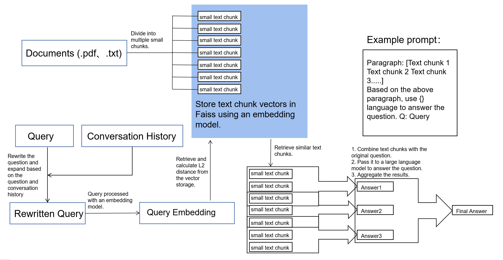
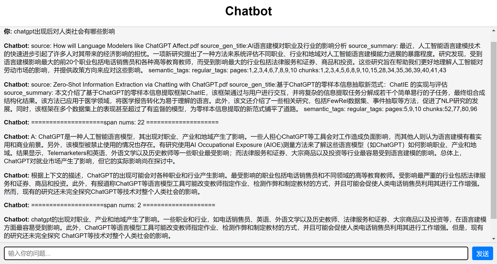

<p align="left">
        <a href="README_CN.md">中文</a>&nbsp ｜ &nbspEnglish&nbsp&nbsp
</p>
<br><br>

# Document/Paper Management System based on OpenAI API/ChatGPT

This is a document/paper management system that allows users to add all PDFs in a folder and index them using OpenAI's embedding technology. Users can retrieve documents through natural language search or tags. After selecting a document/paper, they can engage in conversational question-answering to learn more about the paper. It is also possible to directly retrieve similar text chunks and conduct conversational Q&A at the chunk-level. The session function remembers the context of the previous 3 interactions.
By incorporating question rewriting, the accuracy of both single-turn and multi-turn retrieval has been improved.

Current include:

* Automatic storage of papers in the database from a folder (papers are automatically divided into chunks, summarized and embedded, and then a summary and embedding for the entire paper is obtained)

* Natural language similarity search for papers (query=[xxx])

* conversational question-answering after entering the paper (questions are answered chunk by chunk and then summarized)

* Chunk-level conversational question-answering (directly using natural language dialogue to locate the corresponding chunk in the article and engage in conversational question-answering)

* Simple graphical user interface for chunk-level conversational question-answering.

To be added:

* Semantic tags (newly added papers are automatically added to semantically similar tags)

* Regular tags (manually added and will not automatically include semantically similar papers)

* Design some better prompts

### Configuration

To set up the system, first create a new Conda environment using the following command:

```
conda create --name chatdocuflow python=3.8
conda activate chatdocuflow
```

Next, install the required dependencies:

```
conda install -c pytorch faiss-cpu
pip install -r requirements.txt
```

Start the system by running the following command (main.py for the command line and app.py for the frontend).

```
python main.py --openai_key xxx --language English --system windows
python app.py --openai_key xxx --language English --system windows
```

Replace xxx with your OpenAI API key and replace the parameter after "language" with the desired language. The parameter "system" is either "windows" or "mac".

### Usage

To use the system, simply add your PDF files to the designated folder, and wait for them to be indexed. Then, use the search functionality to find the documents you need. You can also add tags to the documents to help with organization and retrieval.

### Figure

Overall architecture diagram.



Simple Graphical User Interface (GUI).



Initial interface.


Enter "1" to access the search document interface.


Example query=[chatgpt language model].


Enter the corresponding ID to access the document operation interface.


Enter "3" to display the details of the corresponding text chunk in the document.


Enter "1" or "4" to enter document conversation mode and engage in Q&A.


Enter "2" in the initial interface to enter chunk-level conversation mode.


Multi-turn conversation.


Storage in SQLite database.


### Contributing

Contributions are welcome! Please feel free to open issues or pull requests if you have any suggestions or improvements to make.
