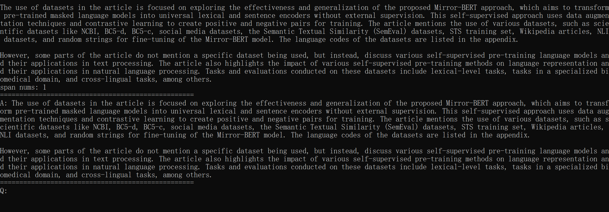
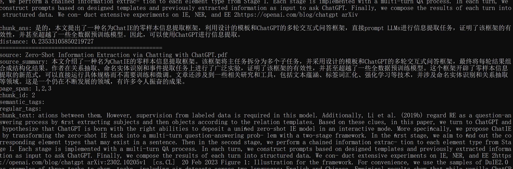
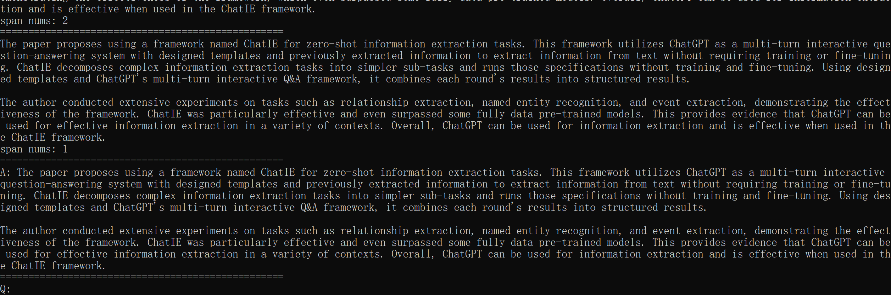
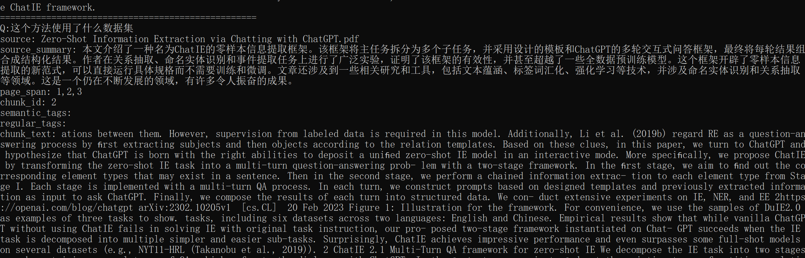
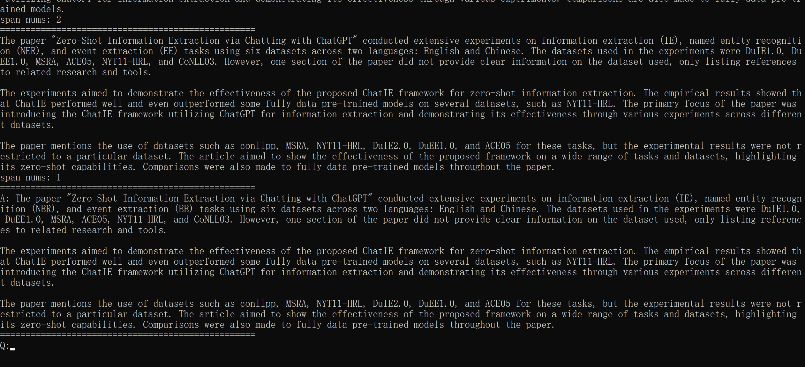

# Document/Paper Management System based on OpenAI API/ChatGPT

This is a document/paper management system that allows users to add all PDFs in a folder and index them using OpenAI's embedding technology. Users can retrieve documents through natural language search or tags. After selecting a document/paper, they can engage in conversational question-answering to learn more about the paper. It is also possible to directly retrieve similar text chunks and conduct conversational Q&A at the chunk-level. The session function remembers the context of the previous two interactions.

Current include:

* Automatic storage of papers in the database from a folder (papers are automatically divided into chunks, summarized and embedded, and then a summary and embedding for the entire paper is obtained)

* Natural language similarity search for papers (query=[xxx])

* conversational question-answering after entering the paper (questions are answered chunk by chunk and then summarized)

* Chunk-level conversational question-answering (directly using natural language dialogue to locate the corresponding chunk in the article and engage in conversational question-answering)

To be added:

* Semantic tags (newly added papers are automatically added to semantically similar tags)

* Regular tags (manually added and will not automatically include semantically similar papers)

* Design some better prompts

### Configuration

To set up the system, first create a new Conda environment using the following command:

```
conda create --name chatdocuflow python=3.8
conda activate chatdocuflow
```

Next, install the required dependencies:

```
conda install -c pytorch faiss-cpu
pip install -r requirements.txt
```

Start the system by running:

```python main.py --openai_key xxx --language English --system windows```

Replace xxx with your OpenAI API key and replace the parameter after "language" with the desired language. The parameter "system" is either "windows" or "mac".

### Usage

To use the system, simply add your PDF files to the designated folder, and wait for them to be indexed. Then, use the search functionality to find the documents you need. You can also add tags to the documents to help with organization and retrieval.

### Contributing

Contributions are welcome! Please feel free to open issues or pull requests if you have any suggestions or improvements to make.

### Figure

Initial interface. / 初始界面


Enter "1" to access the search document interface. / 输入1进入搜索文档界面


Example query=[chatgpt language model]. / 查询示例，query=[chatgpt language model]


Enter the corresponding ID to access the document operation interface. / 输入对应id进入文档操作界面


Enter "3" to display the details of the corresponding text chunk in the document. / 输入3展示对应文档文本块细节


Enter "1" or "4" to enter document conversation mode and engage in Q&A. / 输入1或4进入文档会话模式，进行问答




Enter "2" in the initial interface to enter chunk-level conversation mode. / 初始界面输入2进入块级会话





Multi-turn conversation. / 多轮会话





Storage in SQLite database. / sqlite数据库存储


# 基于OpenAI API/ChatGPT的文档/论文管理系统

这是一个文档/论文管理系统，允许用户添加文件夹中的所有PDF，并使用OpenAI的嵌入技术对其进行索引。用户可以通过自然语言搜索或者标签来检索文档。在选中文档/论文后可以进行会话问答以了解有关论文的问题。也可以直接检索相似文本块，进行文本块级会话问答。会话功能记住2次交互上下文。

目前包含功能：

* 自动将文件夹中论文存入数据库（自动将论文分成块，并对每一块总结并嵌入，最后获得一个整篇文章的总结和嵌入）

* 自然语言相似度搜索论文（query=[xxx]）

* 进入论文后可以进行会话问答，（通过每一块回答问题最后合并总结）

* 文本块级对话（直接通过自然语言对话定位到对应文章的块，并进行会话问答）

将要加入：

* 语义标签（自动将新增论文添加入语义相似的标签）

* 普通标签（手动添加，不会自动加入语义相似的论文）

* 设计更好的prompt

### 配置

要设置系统，首先使用以下命令创建一个新的Conda环境：

```
conda create --name chatdocuflow python=3.8
conda activate doc_chatdocuflow
```

接下来，安装所需的依赖项：

```
conda install -c pytorch faiss-cpu
pip install -r requirements.txt
```

通过运行以下命令启动系统：

```python main.py --openai_key xxx --language Chinese --system windows```

将 xxx 替换为您的OpenAI API密钥，language 后参数替换为所需的语言。system参数为windows或mac。

### 使用

要使用系统，只需将您的PDF文件添加到指定的文件夹中，并等待它们被索引。然后，使用搜索功能查找您需要的文档。您还可以向文档添加标签以帮助组织和检索。

### 贡献

欢迎贡献！如果您有任何建议或改进意见，请随时打开问题或拉取请求。
